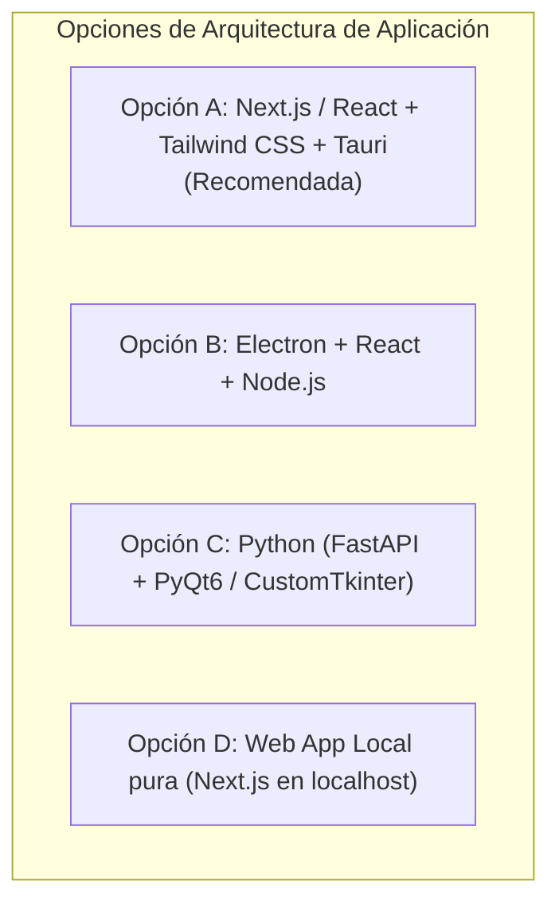

# Evaluación y Matriz de Decisión del Stack Tecnológico
## English Learning Assistant (ELA)

Este documento expone el análisis técnico comparativo para seleccionar las tecnologías del sistema, evaluando factores de rendimiento, consumo de memoria, facilidad de mantenimiento e integración con IA.

---

## 1. Evaluación del Entorno de Ejecución e Interfaz Gráfica

### Tabla Comparativa de Opciones:

| Criterio de Selección | Opción A: Next.js + Tauri (Recomendada) | Opción B: Electron + React | Opción C: Python + PyQt6 | Opción D: Web App Local |
| :--- | :--- | :--- | :--- | :--- |
| **Consumo de Memoria RAM** | **Excelente (35 - 60 MB)** | Pobre (150 - 350 MB) | Bueno (80 - 120 MB) | Bueno (según pestañas del navegador) |
| **Tamaño del Instalador** | **Diminuto (~12 MB)** | Pesado (~95 MB) | Mediano (~45 MB) | N/A (ejecutable vía terminal) |
| **Riqueza de Componentes UI** | **Máxima (React, Tailwind, Radix UI)** | Máxima (React, Tailwind) | Limitada (widgets estándar) | Máxima (React, Tailwind) |
| **Audio y Fonética (TTS)** | **Excelente (Web Audio + WebSpeech)**| Excelente | Complejo en GUI nativa | Excelente |
| **Velocidad de Respuesta** | **Instantánea (60+ FPS)** | Buena | Moderada | Excelente |
| **Facilidad para el Usuario** | **Doble clic en icono de escritorio** | Doble clic | Doble clic | Requiere abrir terminal / navegador |

> **Decisión Técnica:** Se adopta la arquitectura **React + Tailwind CSS** utilizando **HeroUI** como librería oficial de componentes UI, empaquetable mediante **Tauri v2** para ofrecer una aplicación de escritorio nativa, ultraligera (< 60 MB RAM) y con acceso a la bandeja del sistema (*system tray*).
> 
> 👉 *Para la especificación exhaustiva de paquetes, versiones semánticas y manifiestos `package.json`/`Cargo.toml`, consulta [`detailed_tech_stack_and_dependencies.md`](./detailed_tech_stack_and_dependencies.md).*

---

## 2. Capa de Base de Datos y Persistencia

### Decisión: SQLite3 con Modo WAL (Write-Ahead Logging)
- **Justificación:**
  - El software es un asistente de aprendizaje personal de uso local (*local-first*). SQLite es una base de datos embebida de cero configuración, ultrarrápida y con transacciones ACID completas.
  - La activación del modo WAL (`PRAGMA journal_mode = WAL;`) permite lecturas concurrentes simultáneas sin bloquear las escrituras de repasos de tarjetas o registros de error.
  - Portabilidad total: toda la memoria del estudiante reside en un único archivo (`ela_database.sqlite`), facilitando respaldos automáticos y privacidad inexpugnable.

---

## 3. Capa de Inteligencia Artificial: Google Gemini API

### Selección de Modelos (Familia 3.x Flash):
- **`gemini-3.5-flash`:** Validación ultrarrápida de micro-retos y chequeos de sintaxis interactiva en tiempo real (< 800 ms).
- **`gemini-3.6-flash`:** Generación balanceada y ágil de Micro-Workouts dirigidos para erradicar fallas crónicas.
- **`gemini-3.7-flash`:** Modelo de evaluación pedagógica diaria con capacidad analítica avanzada para explicaciones contrastivas de transferencia L1 y *Noticing*.
- **`gemini-3.8-flash`:** Modelo insignia de la familia 3.x Flash. Máximo razonamiento para redacciones complejas, coherencia discursiva, registros formales y calibración CEFR hasta C1/C2 manteniendo la velocidad y economía Flash.

---

## 4. Síntesis y Reproducción de Audio Fonético

### Enfoque Híbrido:
1. **Nivel 1 (Modo Offline / Instantáneo):** `Web Speech API (SpeechSynthesis)`.
   - Utiliza las voces nativas instaladas en Windows (Microsoft Natural Voices en inglés estadounidense y británico).
   - Latencia = 0 ms; funciona sin conexión a Internet.
   - Permite control fino de velocidad de reproducción (1.0x y 0.75x) sin alterar la afinación ni tono de voz (*pitch-preserving*).
2. **Nivel 2 (Modo Alta Definición / Fonemas Aislados):**
   - Repositorio local de archivos de audio MP3/WAV para el Alfabeto Fonético Internacional (IPA) y pares mínimos, almacenados en la carpeta de recursos de la aplicación.
