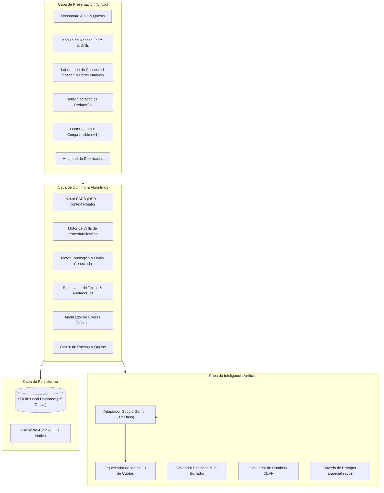

# English Learning Assistant (ELA)
## Especificación de Análisis y Diseño de Software

Bienvenido al repositorio de **Análisis, Diseño y Arquitectura de Software** para el **English Learning Assistant (ELA)**. 

Este proyecto define las especificaciones formales para un software asistido por Inteligencia Artificial (Google Gemini) y fundamentado en las **Ciencias de Adquisición de Segundas Lenguas (Second Language Acquisition - SLA)** y la **Psicología Cognitiva de la Memoria**.

---

## 🎯 Propósito del Sistema

El sistema no pretende sustituir un programa de inmersión total al 100%, sino constituir una herramienta de alto impacto ("power tool") para resolver los mayores obstáculos que enfrenta un estudiante (especialmente hispanohablante):
1. **Retención a largo plazo y anti-interferencia** mediante el algoritmo de Repetición Espaciada **FSRS** (Free Spaced Repetition Scheduler) con **banco de contextos rotativos** y **desagrupación semántica (*interleaving*)**.
2. **Dominio del habla natural y discriminación auditiva** mediante el desglose sistemático de **Habla Conectada (Connected Speech)** y un **Gimnasio de Pares Mínimos** con reproducción y contraste acústico.
3. **Proceduralización y automaticidad gramatical** mediante **Drills de Velocidad (Speed-Retrieval Drills de 3-5 s)** para migrar el conocimiento de la memoria declarativa a los ganglios basales (Modelo DP de Michael Ullman).
4. **Escritura activa con pedagogía socrática** usando la API de **Google Gemini** con un flujo en 2 etapas (**Pistas guiadas de Noticing $\rightarrow$ Auto-corrección $\rightarrow$ Reformulación**) y modalidad de **Micro-Writing**.
5. **Inmersión en Input Comprensible ($i+1$)** con un **Lector Inteligente Graduado (*Smart Graded Reader*)** con captura léxica y auto-enriquecimiento en 1 clic.
6. **Detección inteligente y eliminación de errores crónicos** mediante un motor de analítica que identifica patrones de falla y programa "Micro-Workouts" personalizados.
7. **Construcción de hábitos inquebrantables** a través de un panel de tareas diarias (*Daily Quests*) y un sistema de rachas protegidas (*Streak Freezes*).
8. **Resiliencia de cuotas IA** con la **Matriz 2D Modelo x Clave** (80 RPD por clave, 5 RPM y reseteo diario a medianoche PT).

---

## 📚 Estructura de Documentación de Ingeniería

La documentación técnica se organiza en los siguientes módulos:

| Directorio | Título | Descripción |
| :--- | :--- | :--- |
| [`01_requirements/`](./01_requirements/) | **Requisitos de Software (SRS)** | Especificación formal IEEE 830: Requisitos Funcionales (RF), No Funcionales (RNF), Historias de Usuario con BDD/Gherkin y Matriz de Trazabilidad. |
| [`02_pedagogical_framework/`](./02_pedagogical_framework/) | **Marco Pedagógico & Lingüístico** | Fundamentos científicos (SLA, FSRS, Modelo DP de Ullman, Discriminación Perceptual de Kuhl), taxonomía léxica, fonología de Habla Conectada, discriminación acústica y matriz de transferencia L1. |
| [`03_architecture_and_design/`](./03_architecture_and_design/) | **Arquitectura del Sistema** | Modelo C4 (Contexto, Contenedores, Componentes), Diseño Guiado por el Dominio (DDD) y Diagramas de Secuencia de procesos clave. |
| [`04_data_models_and_schemas/`](./04_data_models_and_schemas/) | **Modelos de Datos y Esquemas** | Diagrama Entidad-Relación (ER), Esquema formal SQL DDL para SQLite (15 tablas) con índices, y esquemas JSON para contratos de API. |
| [`05_algorithms/`](./05_algorithms/) | **Especificación de Algoritmos** | Modelado matemático de FSRS (DSR), rotación contextual, desagrupación semántica, detección de fallas crónicas y heatmap, máquina de estados de tareas y rachas, y la **Matriz 2D de Resiliencia de Cuotas IA**. |
| [`06_ai_specifications/`](./06_ai_specifications/) | **Integración con Google Gemini** | Arquitectura de llamadas a Gemini (Familia 3.x Flash: 3.5, 3.6, 3.7 y 3.8), prompts socráticos multi-borrador, auto-enriquecimiento de vocabulario, JSON schemas y rúbricas CEFR. |
| [`07_ui_ux_specifications/`](./07_ui_ux_specifications/) | **Diseño de Interfaz y Experiencia** | Sistema de Diseño "Warm Minimalist & Editorial Tech", arquitectura de información, flujos de usuario, guía de estilos exhaustiva (tokens Tailwind, tipografía IPA y WCAG 2.1 AAA) y wireframes de las 10 pantallas. |
| [`08_implementation_roadmap/`](./08_implementation_roadmap/) | **Hoja de Ruta y Evaluación Técnica** | Fases cronológicas de desarrollo integradas, entregables, evaluación comparativa del stack tecnológico (Tauri, Next.js, FastAPI, etc.). |

---

## 🧭 Diagrama de Alto Nivel de la Arquitectura

---

## 📌 Guía de Inicio Rápido para Lectura

1. Si deseas comprender **qué hace el sistema y por qué**: lee [`01_requirements/functional_requirements.md`](./01_requirements/functional_requirements.md) y [`02_pedagogical_framework/second_language_acquisition.md`](./02_pedagogical_framework/second_language_acquisition.md).
2. Si deseas profundizar en la **fonética y el habla conectada**: consulta [`02_pedagogical_framework/connected_speech_guide.md`](./02_pedagogical_framework/connected_speech_guide.md).
3. Si deseas entender el **algoritmo matemático de memoria**: lee [`05_algorithms/fsrs_spaced_repetition_spec.md`](./05_algorithms/fsrs_spaced_repetition_spec.md).
4. Si deseas ver el **modelo de datos**: revisa [`04_data_models_and_schemas/sqlite_schema.sql`](./04_data_models_and_schemas/sqlite_schema.sql) y [`04_data_models_and_schemas/entity_relationship_diagram.md`](./04_data_models_and_schemas/entity_relationship_diagram.md).
5. Si deseas ver cómo se **integra la IA de Gemini**: consulta [`06_ai_specifications/prompt_templates.md`](./06_ai_specifications/prompt_templates.md) y [`06_ai_specifications/gemini_integration_architecture.md`](./06_ai_specifications/gemini_integration_architecture.md).
6. Si deseas comprender la **estrategia de tolerancia a fallos y cuotas (80 RPD/clave)**: consulta [`05_algorithms/ai_quota_resilience_matrix.md`](./05_algorithms/ai_quota_resilience_matrix.md).
7. Si deseas ver los **wireframes y especificaciones visuales de las 10 pantallas**: consulta [`07_ui_ux_specifications/screen_wireframes_and_components.md`](./07_ui_ux_specifications/screen_wireframes_and_components.md).
8. Si deseas explorar el **Sistema de Diseño "Warm Minimalist & Editorial Tech" (paletas claro/oscuro, tipografías IPA/editorial, escala de texto, tokens Tailwind y ratios WCAG AAA)**: consulta [`07_ui_ux_specifications/design_system_and_style_guide.md`](./07_ui_ux_specifications/design_system_and_style_guide.md).
9. Si deseas consultar la **especificación detallada de vistas, composición espacial, ritmo de espaciado y micro-animaciones**: consulta [`07_ui_ux_specifications/view_design_specifications.md`](./07_ui_ux_specifications/view_design_specifications.md).
10. Si deseas revisar la **especificación exhaustiva del stack tecnológico, librerías, dependencias (HeroUI, Tauri v2, SQLite, Gemini) y manifiestos `package.json`/`Cargo.toml`**: consulta [`08_implementation_roadmap/detailed_tech_stack_and_dependencies.md`](./08_implementation_roadmap/detailed_tech_stack_and_dependencies.md).
