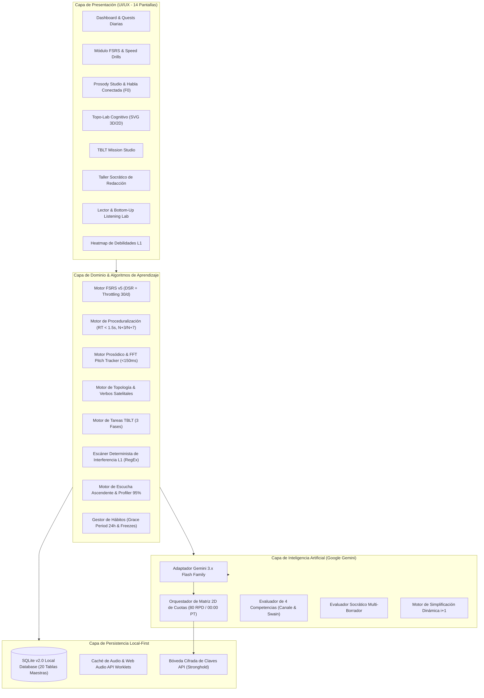

# English Learning Assistant (ELA)
## Especificación Integral de Análisis, Diseño y Arquitectura de Software

Bienvenido al repositorio central de **Análisis, Diseño y Arquitectura de Software** para el **English Learning Assistant (ELA)**. 

Este proyecto define las especificaciones formales para un software asistido por Inteligencia Artificial (Google Gemini 3.x Flash) y fundamentado en las **Ciencias de Adquisición de Segundas Lenguas (Second Language Acquisition - SLA)**, la **Psicología Cognitiva de la Memoria**, la **Fonética Acústica** y la **Gramática Cognitiva**.

---

## 🎯 Propósito del Sistema: Dominio en el Menor Tiempo Posible

El objetivo del sistema es conseguir un dominio operativo real del idioma inglés reduciendo al mínimo el tiempo requerido para alcanzar la automaticidad lingüística. Para lograrlo, aborda los cuellos de botella psicotípicos más severos (especialmente en hablantes nativos de español):

1. **Retención a Largo Plazo sin "Infierno de Repasos":** Algoritmo de Repetición Espaciada **FSRS v5** con **banco de contextos rotativos**, **desagrupación semántica (*interleaving*)** y **estrangulamiento de atrasos (*backlog throttling*)** limitado a 30 tarjetas/día con redistribución a 7 días.
2. **Proceduralización y Automatización Motora:** Entrenamiento en los ganglios basales (Modelo DP de Michael Ullman) mediante **Speed Drills (RT < 1.5s)** con bucle de corrección caliente $N+3 / N+7$ y certificación por la Ley de Potencia de Newell & Rosenbloom.
3. **Discriminación Auditiva y Percepción Acústica:** Gimnasio **HVPT** de pares mínimos forzado en 2.0s y desglosador de **Habla Conectada** (linking, flapping, glottal stops, reducción a Schwa).
4. **Prosodia e Isocronía Rítmica (Prosody Studio):** Extracción de contorno entonativo **F0 en tiempo real** (< 150 ms con Web Audio API FFT) y metrónomo de ritmo acentual (*stress-timed rhythm*) para erradicar la transferencia silábica L1.
5. **Laboratorio Cognitivo y Topológico (Topo-Lab):** Internalización de preposiciones espaciales (in, on, at, into, onto) y verbos de movimiento satelitales (*Manner in Verb + Path in Particle*) mediante simuladores vectoriales SVG y redes polisémicas radiales.
6. **Misiones TBLT y Competencia Comunicativa Real:** Ciclos de 3 fases (*Pre-Task, Task Execution bajo presión real, Post-Task AI Review*) evaluados sobre las 4 competencias de Canale & Swain (Lingüística, Sociolingüística/Hedging, Discursiva y Estratégica) calibradas de A2 a C1.
7. **Escucha Ascendente y Cobertura Léxica (Bottom-Up Listening):** Decodificación en 3 pasos (Audio Ciego $\rightarrow$ Acoustic Noticing con transcripción de chunks $\rightarrow$ Integración de texto completo) con **Lexical Profiler de Paul Nation** (cobertura 95% / 98% con familias K1-K5).
8. **Taller Socrático de Redacción y Detección L1:** Escáner determinista previo de patrones de interferencia L1 (pro-drop, *existential have*, falsos amigos) seguido de andamiaje socrático de *Noticing* en dos borradores con micro-reto de consolidación.
9. **Resiliencia de Cuotas IA:** **Matriz 2D Modelo × Clave** con failover sub-500ms ante HTTP 429 (80 RPD por clave, 5 RPM y reseteo diario a las 00:00 Pacific Time).
10. **Sostenibilidad Psicológica y Prevención del Abandono:** Ventana de gracia de 24 horas y fichas *Streak Freeze* automáticas para neutralizar el efecto "What-the-Hell".

---

## 📚 Estructura de Documentación de Ingeniería

La documentación técnica se organiza en los siguientes módulos rigurosamente trazados:

| Directorio | Título | Descripción |
| :--- | :--- | :--- |
| [`01_requirements/`](./01_requirements/) | **Requisitos de Software (SRS)** | Especificación formal IEEE 830: 14 Módulos Funcionales (RF-VOC a RF-AIC), Requisitos No Funcionales (RNF), 13 Historias de Usuario BDD/Gherkin y Matriz de Trazabilidad 100% 1:1. |
| [`02_pedagogical_framework/`](./02_pedagogical_framework/) | **Marco Pedagógico & Lingüístico** | Fundamentos científicos (SLA, FSRS, Modelo DP de Ullman, Discriminación Perceptual de Kuhl), taxonomía léxica, fonología de Habla Conectada, discriminación acústica y matriz de transferencia L1. |
| [`03_architecture_and_design/`](./03_architecture_and_design/) | **Arquitectura del Sistema** | Modelo C4 (Contexto, Contenedores, Componentes de los 8 subsistemas de dominio), Diseño Guiado por el Dominio (DDD) y Diagramas de Secuencia para HVPT, F0 Shadowing, TBLT y Speed Drills. |
| [`04_data_models_and_schemas/`](./04_data_models_and_schemas/) | **Modelos de Datos y Esquemas** | Diagrama ER completo, Esquema formal SQL DDL v2.0 para SQLite (20 tablas maestras) con índices validados, y esquemas JSON para contratos de API y payloads de IA. |
| [`05_algorithms/`](./05_algorithms/) | **Especificación de Algoritmos** | Modelado de FSRS v5, proceduralización y Ley de Newell & Rosenbloom, profiler de Nation 95/98%, reglas de interferencia L1 deterministas, decaimiento temporal en Heatmap ($\tau = 7\text{d}$) y Matriz 2D de Cuotas. |
| [`06_ai_specifications/`](./06_ai_specifications/) | **Integración con Google Gemini** | Gateway para la familia Gemini 3.x Flash, prompts especializados para TBLT 4-competencias, simplificación $i+1$, taller socrático y rúbricas CEFR detalladas (A2 a C1 con análisis de hedging). |
| [`07_ui_ux_specifications/`](./07_ui_ux_specifications/) | **Diseño de Interfaz y Experiencia** | Sistema de Diseño "Warm Minimalist & Editorial Tech", arquitectura de información, flujos de usuario completos, y wireframes/especificaciones de las 14 pantallas del sistema. |
| [`08_implementation_roadmap/`](./08_implementation_roadmap/) | **Hoja de Ruta y Evaluación Técnica** | Hoja de ruta en 6 fases de desarrollo, especificación detallada de dependencias con HeroUI v3, Tailwind v4, Tauri v2, SQLite y Web Audio API. |

---

## 🧭 Diagrama de Alto Nivel de la Arquitectura del Sistema

---

## 📌 Guía Rápida de Navegación por Documento

1. **Requisitos Funcionales Completos (14 Módulos):** [`docs/01_requirements/functional_requirements.md`](file:///c:/Users/Josnaiker%20Rivas/Desktop/english_learning_assistant/docs/01_requirements/functional_requirements.md)
2. **Matriz de Trazabilidad 100% 1:1:** [`docs/01_requirements/traceability_matrix.md`](file:///c:/Users/Josnaiker%20Rivas/Desktop/english_learning_assistant/docs/01_requirements/traceability_matrix.md)
3. **Arquitectura C4 y Subsistemas de Dominio:** [`docs/03_architecture_and_design/c4_system_architecture.md`](file:///c:/Users/Josnaiker%20Rivas/Desktop/english_learning_assistant/docs/03_architecture_and_design/c4_system_architecture.md)
4. **Esquema Relacional SQLite v2.0 DDL:** [`docs/04_data_models_and_schemas/sqlite_schema.sql`](file:///c:/Users/Josnaiker%20Rivas/Desktop/english_learning_assistant/docs/04_data_models_and_schemas/sqlite_schema.sql)
5. **Algoritmo de Proceduralización y Speed Drills:** [`docs/05_algorithms/proceduralization_and_speed_drills.md`](file:///c:/Users/Josnaiker%20Rivas/Desktop/english_learning_assistant/docs/05_algorithms/proceduralization_and_speed_drills.md)
6. **Escucha Ascendente y Lexical Profiler:** [`docs/05_algorithms/bottom_up_listening_and_lexical_profiler.md`](file:///c:/Users/Josnaiker%20Rivas/Desktop/english_learning_assistant/docs/05_algorithms/bottom_up_listening_and_lexical_profiler.md)
7. **Reglas Deterministas de Interferencia L1:** [`docs/05_algorithms/l1_interference_detection_rules.md`](file:///c:/Users/Josnaiker%20Rivas/Desktop/english_learning_assistant/docs/05_algorithms/l1_interference_detection_rules.md)
8. **Rúbricas de Evaluación CEFR y 4 Competencias TBLT:** [`docs/06_ai_specifications/evaluation_rubrics.md`](file:///c:/Users/Josnaiker%20Rivas/Desktop/english_learning_assistant/docs/06_ai_specifications/evaluation_rubrics.md)
9. **Wireframes y Componentes de las 14 Pantallas:** [`docs/07_ui_ux_specifications/screen_wireframes_and_components.md`](file:///c:/Users/Josnaiker%20Rivas/Desktop/english_learning_assistant/docs/07_ui_ux_specifications/screen_wireframes_and_components.md)
10. **Hoja de Ruta de Implementación en 6 Fases:** [`docs/08_implementation_roadmap/milestones_and_phases.md`](file:///c:/Users/Josnaiker%20Rivas/Desktop/english_learning_assistant/docs/08_implementation_roadmap/milestones_and_phases.md)
